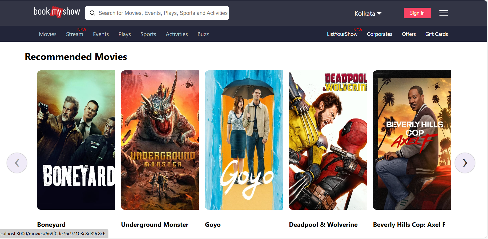
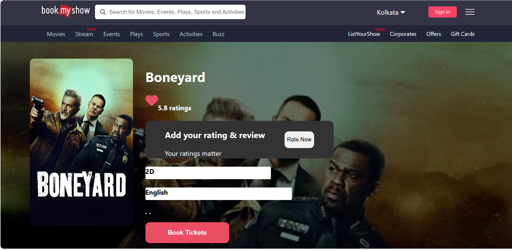
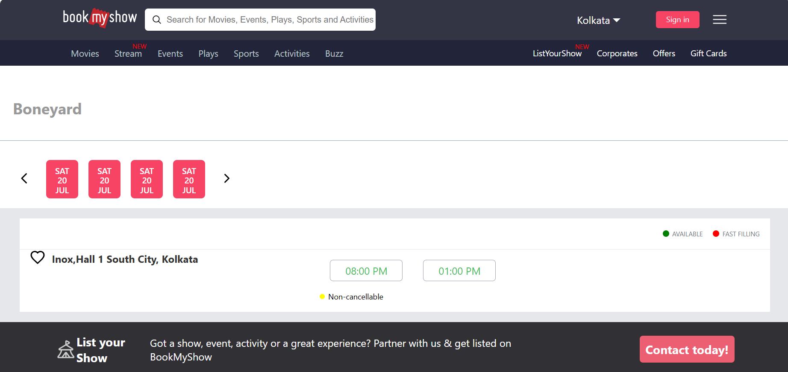
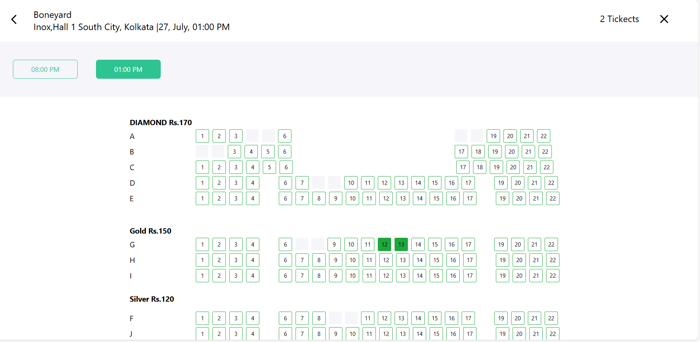
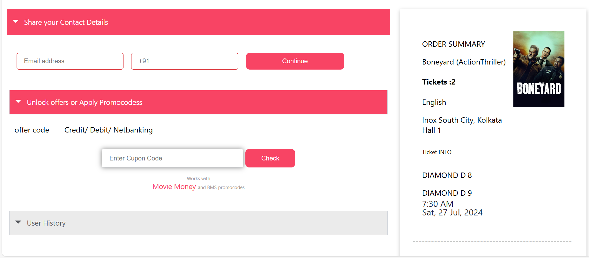
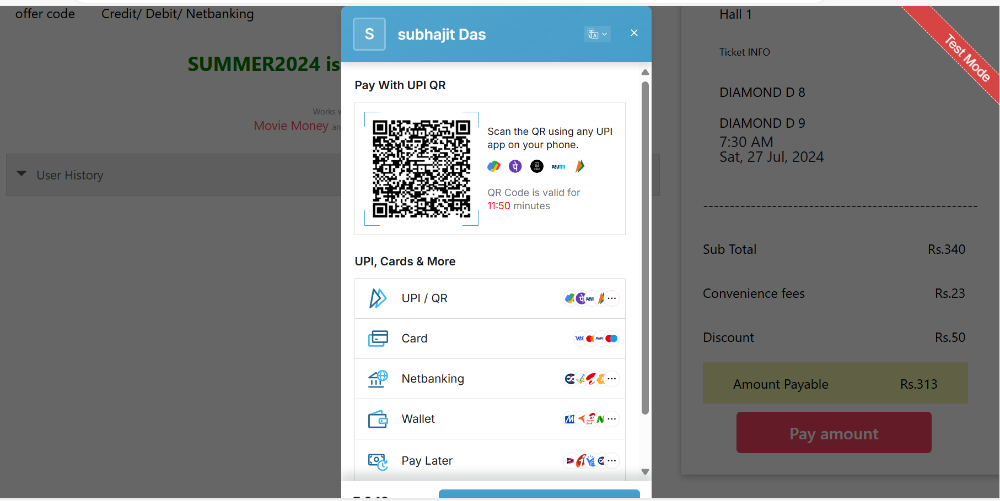

# Ticket Booking App

## Overview

The Ticket Booking App is a highly concurrent system designed to streamline the process of booking tickets for events, movies, or travel. The app ensures a smooth user experience by temporarily reserving tickets when a user initiates payment. If the payment is not completed within 10 minutes, the ticket is automatically unreserved, and the user is redirected to the homepage.

## Features

- **High Concurrency**: The app efficiently handles multiple users simultaneously.
- **Ticket Reservation**: Once a user clicks the pay button, the ticket is reserved for 10 minutes.
- **Auto Unreserve**: If the user does not complete the payment within 10 minutes, the ticket is unreserved, and the user is redirected to the homepage.
- **Payment Integration**: Integrated with Razorpay for secure and reliable payment processing.
- **Downloadable Tickets**: After a successful payment, users can download their tickets.
- **User Details**: Before proceeding to payment, users must enter their email and phone number.
- **Discounts/Offers**: The system includes functionality for applying discounts or offers during the booking process.
- **Seat Differentiation**: The app clearly differentiates between available seats, booked tickets, and unbooked tickets.

## Screenshots

Include screenshots that demonstrate the key functionalities of the app:

1. **Home Page**: Displaying available events or shows.





2.**Avaliable Hall**:



3. **Seat Selection**: Showing differentiable seats (available, booked).



4. **User Details Form And Offer And Pay**: Where users enter their email and phone number,Apply Cupon,Procede To Pay.



5. **Payment Page**: Showing the Razorpay integration.




## Getting Started

Follow these instructions to get a copy of the project up and running on your local machine.

### Prerequisites

- Node.js
- Express js
- React
- MongoDB
- Razorpay API Key

### Installation

1. Clone the repository:
   ```bash
   git clone https://github.com/Subhajit1947/Online-Ticket-Booking-App.git
